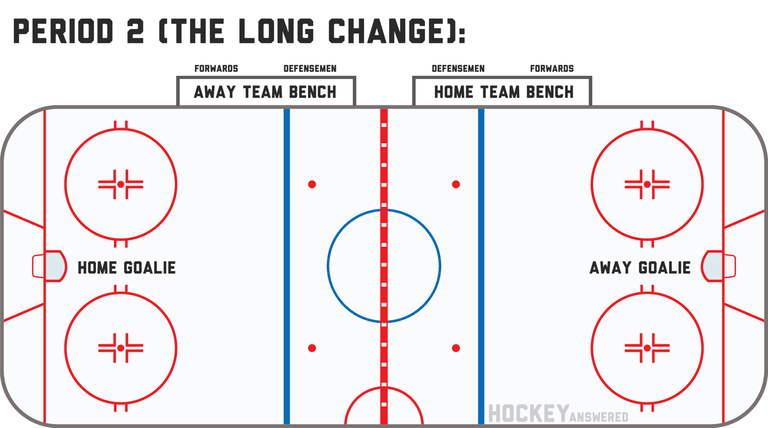
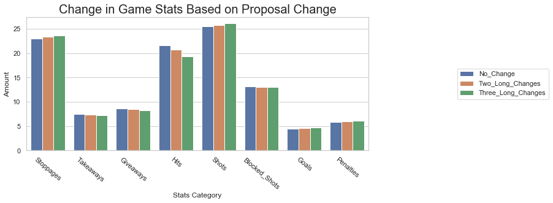

# The Long Change Effect in NHL Gameplay

## Description
The goal of this project is to make the case for having **two, or even three, long changes in the NHL**. To convince the reader of this change, **I review game statistics from 8 season of NHL gameplay and calculate the average values per game under the two scenarios**. To "create" the two scenarios, I add the average value for a stat in the first and second periods in different combinations: for the two long changes, two second periods and one first period, and for the three long changes, three second periods. Additionally, I scale each third period scenario so that the proportion between the current third period stats and the first period stats retain the change in game strategy that would also occur in both scenarios. By doing this, I capture the change in strategy that occurs at the very end of the game, where, in most cases, one team is leading and needs to score to tie or win the game.

## Data 
The data originally came from the NHL stats API, but was collected in SQL tables [here](https://www.kaggle.com/martinellis/nhl-game-data). I stored this data in the Google Cloud Platform and used SQL queries to collect data. The SQL queries were run in Python using the mysql.connector package. I transformed and visualized this data. I also visualized the data in Tableau, creating a [story](https://public.tableau.com/profile/greg.feliu#!/vizhome/NHL_proposal_story/ExtendingtheLongChangeNHLProposal) to display my findings. 

## Findings
I find that goals, shots, the length of player shifts, and penalties will increase by a modest amount under both scenarios, more so in the three long changes scenario. 

These stats are all part of what is makes up "exciting hockey". The stats mean that there will be more lead changes and odd-man situations in games. I also find that less important categories, e.g.: takeaways, giveaways, etc., do not significantly differ under any of the proposals. 

## Presentations of Data 
The project is described in further detail in a [blog post](https://gregfeliu.medium.com/is-it-time-to-increase-the-use-of-the-long-change-in-hockey-a-proposal-for-the-nhl-132a7a3dd894). Additionally, the data is presented in a [Tableau story](https://public.tableau.com/profile/greg.feliu#!/vizhome/NHL_proposal_story/ExtendingtheLongChangeNHLProposal).

## Technologies used
- Google Cloud Platform
- Jupyter Notebook
- Tableau
- Python 
    - mysql.connector (for SQL)
    - Seaborn
    - pickle 
    - Pandas
